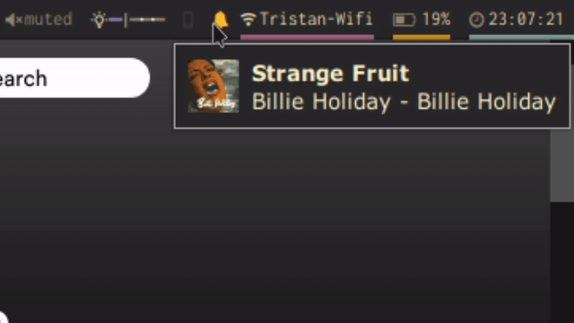

# dunst-polybar
[Dunst](https://github.com/dunst-project/dunst) notifications switch module for [Polybar](https://github.com/jaagr/polybar)



## Dependencies
* [Font Awesome](https://github.com/FortAwesome/Font-Awesome)
* [Dunst](https://github.com/dunst-project/dunst)

## Usage
Write the given module to your polybar `config`, make sure `enable-ipc = true`
```
[module/dunst]
type = custom/ipc
initial = 1
format-foreground = ${colors.yellow}

hook-0 = echo "%{A1:dunstctl set-paused true && polybar-msg hook dunst 2:}%{A}" &
hook-1 = echo "%{A1:dunstctl set-paused false && polybar-msg hook dunst 1:}%{A}" &
```
## Customization
You can change the icons in `hook-0` and `hook-1` (between theses two caracters: `}"Insert icon here"%`). You can also change the color of the icon by modifying `format-foreground`
